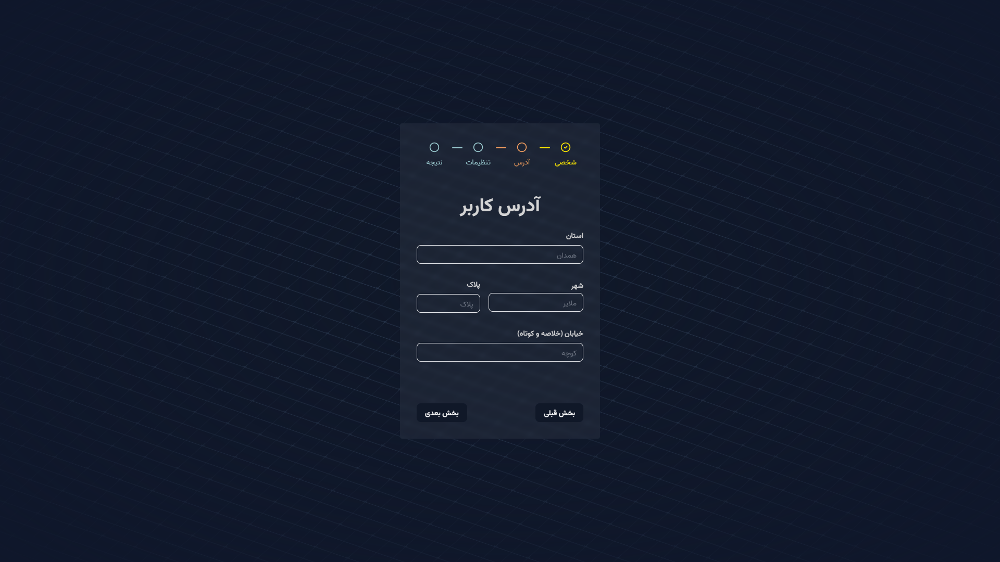

# Multi-Step Form Application

A modern, responsive multi-step form application built with React, TypeScript, and Vite. This project demonstrates a step-by-step form workflow with state management using React Context and useReducer.



[**Live Demo**](https://multi-form-z6bp.onrender.com)

## Table of Contents

-   [Project Overview](#project-overview)
-   [Features](#features)
-   [Tech Stack](#tech-stack)
-   [Installation](#installation)
-   [Usage](#usage)
-   [Project Structure](#project-structure)
-   [Form Steps](#form-steps)
-   [State Management](#state-management)
-   [Components](#components)
-   [Contributing](#contributing)
-   [License](#license)

## Project Overview

This is a multi-step form application that guides users through a series of form steps to collect information. The application features a clean, modern UI with a progress indicator showing the user's current position in the form flow. Data is persisted across steps using React's Context API and useReducer hook.

## Features

-   Multi-step form navigation with progress indicator
-   Responsive design using Tailwind CSS
-   Form state management with React Context and useReducer
-   Validation and controlled components
-   Persian/English bilingual interface
-   Modern UI components from Radix UI
-   Date picker for date selection
-   Dark-themed interface with glass-morphism effects

## Tech Stack

-   [React 19](https://reactjs.org/) - Frontend library
-   [TypeScript](https://www.typescriptlang.org/) - Typed JavaScript
-   [Vite](https://vitejs.dev/) - Fast build tool
-   [React Router 7](https://reactrouter.com/) - Routing library
-   [Tailwind CSS 4](https://tailwindcss.com/) - Utility-first CSS framework
-   [Radix UI](https://www.radix-ui.com/) - Accessible UI components
-   [React Hook Form](https://react-hook-form.com/) - Form validation
-   [Zod](https://zod.dev/) - Schema validation

## Installation

1. Clone the repository:

    ```bash
    git clone <repository-url>
    ```

2. Navigate to the project directory:

    ```bash
    cd multi-form
    ```

3. Install dependencies using pnpm:
    ```bash
    pnpm install
    ```

## Usage

### Development

Start the development server:

```bash
pnpm dev
```

The application will be available at `http://localhost:5173` by default.

### Build

Create a production build:

```bash
pnpm build
```

### Preview

Preview the production build locally:

```bash
pnpm preview
```

### Linting

Check for linting issues:

```bash
pnpm lint
```

## Project Structure

```
src/
├── components/        # Reusable UI components
├── context/           # React context providers
├── lib/               # Utility functions
├── pages/             # Form step components
├── reducers/          # State reducers
├── types/             # TypeScript types
├── App.tsx            # Main application component
└── main.tsx           # Application entry point
```

## Form Steps

1. **Personal Information** - Collects user's first name, last name, email, and date of birth
2. **Address Information** - Collects street address, city, state, and postal code
3. **Preferences** - Collects user preferences for newsletter, notifications, and theme
4. **Summary** - Displays all collected information for review

Each step is implemented as a separate component in the [pages](src/pages) directory.

## State Management

The application uses React's Context API combined with useReducer for state management:

-   [FormContext](src/context/FormContext.tsx) - Provides form state and dispatch function
-   [formReducer](src/reducers/formReducer.ts) - Handles state updates for each form step
-   [FormDataType](src/types/index.ts) - Defines the structure of the form data

The form data structure includes:

```typescript
{
	personalInfo: {
		firstName: string;
		lastName: string;
		email: string;
		date: Date;
	}
	address: {
		street: string;
		city: string;
		cState: string;
		code: string;
	}
	preferences: {
		newsLetter: boolean;
		notifications: boolean;
		theme: "light" | "dark";
	}
}
```

## Components

Key components used in the application:

-   [Progress](src/components/Progress.tsx) - Step indicator showing current position
-   [Button](src/components/ui/button.tsx) - Customized button component
-   [Input](src/components/ui/input.tsx) - Styled input fields
-   [Label](src/components/ui/label.tsx) - Form labels
-   [Calendar](src/components/ui/calendar.tsx) - Date picker component
-   [Popover](src/components/ui/popover.tsx) - Popover container for calendar

## Contributing

Contributions are welcome! Please follow these steps:

1. Fork the repository
2. Create a feature branch (`git checkout -b feature/AmazingFeature`)
3. Commit your changes (`git commit -m 'Add some AmazingFeature'`)
4. Push to the branch (`git push origin feature/AmazingFeature`)
5. Open a Pull Request

### Code Style

-   Follow the existing code style
-   Use TypeScript for type safety
-   Write functional components with hooks
-   Ensure components are properly typed
-   Use Tailwind CSS for styling

## License

This project is licensed under the MIT License - see the [LICENSE](LICENSE) file for details.
